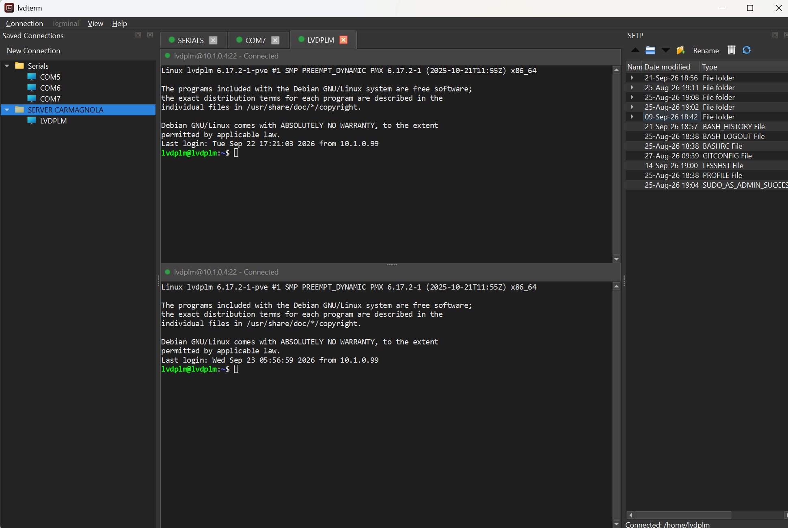
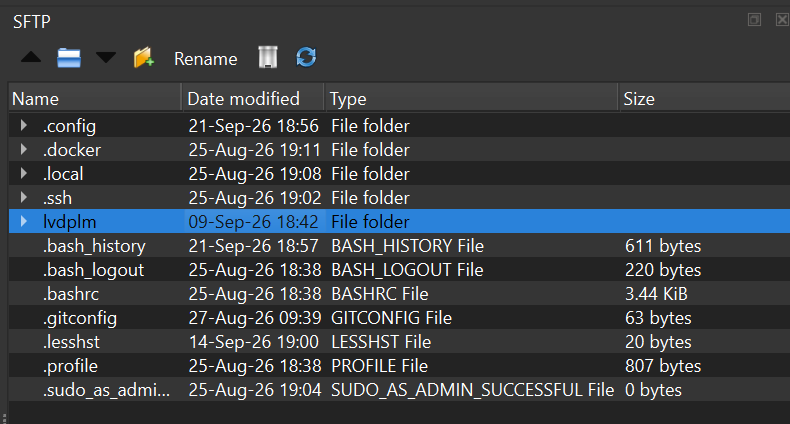
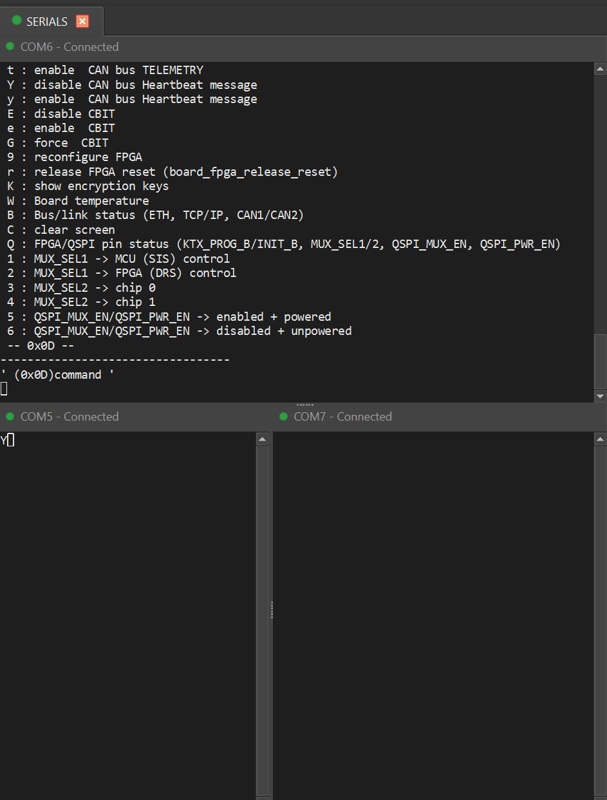
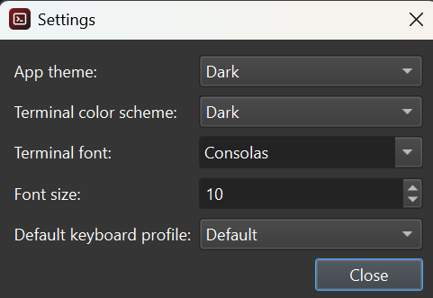
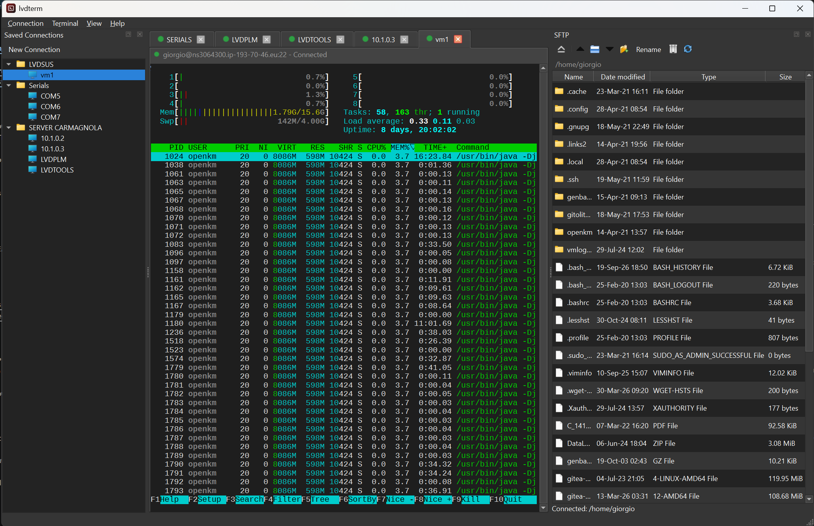

<p align="center">
  
</p>

<h1 align="center">lvdterm</h1>

<p align="center">
  A tabbed and splittable SSH / Telnet / Serial terminal emulator for Windows.
</p>

<p align="center">
  <a href="LICENSE"></a>
  
  
  
</p>

lvdterm is an open-source alternative to tools like mputty, teraterm, ... : one window,
tabs and split panes, saved connections organized in folders, and an SFTP
file browser docked alongside your shell — built on Qt 6 and a vendored,
Windows-ported copy of Konsole/QTermWidget's terminal-emulation core (no
Cygwin, no WSL requirement, no bundled X server).

Built by [LVD Systems S.r.l.](https://www.lvdsystems.eu) and released as
part of [LVD Open](https://www.lvdopen.eu).

## Screenshots

<!-- Add real screenshots to docs/screenshots/ - see docs/screenshots/README.md
     for the exact filenames these links expect. -->

| | |
|---|---|
|  |  |
|  |  |

`htop` rendering correctly - full-screen redraws, live-updating colored
bars, and heavy box-drawing/alignment all come from the vendored
terminal-emulation core, not anything lvdterm adds on top:



## Features

- **Connections**: Serial (with a live COM-port picker), Telnet, Raw TCP
  (no Telnet protocol negotiation), and SSH (password or key-based auth).
- **Tabs and splits**: any tab can be split horizontally or vertically,
  duplicating the current connection or starting a new one; each tab shows
  a colored status dot rolled up from every pane inside it.
- **Saved connections**: a folder-organized dock of saved connections,
  edited in place (add/edit/duplicate/delete/rename); secrets are
  encrypted at rest with Windows DPAPI (still local-machine storage, not a
  secrets vault — the app tells you this up front).
- **Auto-reconnect**: a dropped connection retries with backoff and shows
  a live countdown/cancel overlay right over the affected pane.
- **Session save/restore**: your whole tab/split layout (including saved
  and ad-hoc connections alike) is restored on the next launch.
- **SFTP dock**: an Explorer-style details view (Name / Date modified /
  Type / Size) for the currently focused SSH pane's remote filesystem —
  drag-and-drop upload for files and whole folders (recursive), a
  right-click context menu (rename/delete/download), and a non-blocking
  toolbar for everything else.
- **Terminal niceties**: auto-copy on selection, a right-click context
  menu (Clear Buffer / Clear Screen / Copy / Paste) mirrored in a
  "Terminal" menu, Ctrl+F scrollback search, session logging to a file,
  and selectable keyboard-emulation profiles (Default / Linux Console /
  VT100) for keys that differ between them (arrows, Home/End, function
  keys, Backspace).
- **Appearance**: Dark/Light themes, a few built-in color schemes, and a
  configurable monospaced terminal font.

## How it compares

Feature sets shift over time (especially between free/paid tiers), so
treat this as a snapshot, not gospel — corrections welcome via an issue
or PR.

| | **lvdterm** | **PuTTY** | **mPuTTY / MTPuTTY** | **Tera Term** | 
|---|---|---|---|---|
| License / cost | Free, open source (GPL-3.0-or-later) | Free, open source (MIT) | Free, open source (wraps `putty.exe`) | Free, open source (BSD-style) | 
| Protocols | SSH, Telnet, Serial, Raw TCP | SSH, Telnet, Rlogin, Serial | Whatever the wrapped PuTTY supports (SSH, Telnet, Rlogin, Serial) | SSH, Telnet, Serial | 
| Tabs | ✅ | ❌ (one top-level window per session) | ✅ | ✅ | 
| Split panes | ✅ | ❌ | ✅ (drag a tab to an edge) | ❌ | 
| Saved connections | ✅ folder tree | ❌ flat list, stored in the registry | ✅ folder tree | Flat session list |
| Secrets at rest | Encrypted (Windows DPAPI) | Plaintext in the registry | Plaintext (delegates to PuTTY's own storage) | Plaintext | 
| SFTP browser | ✅ built-in, Explorer-style, drag-and-drop | ❌ separate `psftp.exe`/`pscp.exe` CLI tools | ❌ launches external `psftp`/`pscp` | ❌ no GUI SFTP (SCP via macro only) |
| Auto-reconnect | ✅ with backoff + a live retry countdown | ❌ | ❌ | ❌ | 
| Session layout save/restore | ✅ whole tab/split layout, across restarts | ❌ | Reopens saved sessions, not a live layout | ❌ | 
| Local shell tab (cmd/PowerShell/WSL) | Not yet (on the roadmap) | ❌ | ❌ | ❌ |
| Macro / scripting | ❌ | ❌ (scriptable only externally via `plink`) | Basic (auto-login, run commands on connect) | ✅ powerful (Tera Term Language) |
| Platform | Windows | Windows (plus community Unix/Mac ports) | Windows | Windows |

## Installing

No signed installer is published yet (see [`installer/lvdterm.iss`](installer/lvdterm.iss)
for the [Inno Setup](https://jrsoftware.org/isinfo.php) script used to
build one, once compiled). Until then, build from source below.

## Building from source

**Prerequisites**

- [Qt 6](https://www.qt.io/download-qt-installer) (developed against 6.11),
  with an **llvm-mingw** kit (clang + libc++ targeting mingw-w64) —
  installed via the Qt Maintenance Tool's "Additional Libraries" page.
- [CMake](https://cmake.org/) 3.25+ and [Ninja](https://ninja-build.org/).
- The llvm-mingw toolchain itself (bundled with the Qt Tools installer
  alongside the llvm-mingw Qt kit above).

**Configure and build**

This repo's [`CMakePresets.json`](CMakePresets.json) hardcodes this
project's own dev-machine paths (`C:/Qt/6.11.1/llvm-mingw_64`, etc.) —
edit them to match where Qt and the llvm-mingw toolchain landed on yours
before configuring, or override them via a local `CMakeUserPresets.json`
(already gitignored).

```sh
cmake --preset llvm-mingw-release
cmake --build --preset llvm-mingw-release
```

This produces `build/llvm-mingw-release/dist/lvdterm.exe` together with
the Qt runtime DLLs it needs (via `windeployqt`, run automatically as a
post-build step) — the `dist/` folder is ready to zip up or hand to the
Inno Setup script above.

A `llvm-mingw` (Debug) preset is also defined, building to
`build/llvm-mingw/dist/`.

## Third-party components

lvdterm vendors a stripped-down, Windows-ported copy of
[Konsole](https://konsole.kde.org/)/[QTermWidget](https://github.com/lxqt/qtermwidget)'s
terminal-emulation core, and statically links
[libssh2](https://www.libssh2.org/) (built against a vendored OpenSSL) for
SSH/SFTP. See [`THIRD_PARTY_LICENSES.md`](THIRD_PARTY_LICENSES.md) for the
full list and why that combination makes GPL-3.0-**or-later** (not plain
GPL-2.0) the correct license for the combined binary, and
[`third_party/qtermwidget/VENDORING.md`](third_party/qtermwidget/VENDORING.md)
for exactly what was kept, dropped, or patched from upstream QTermWidget.

## License

lvdterm is licensed under the [GNU General Public License, version 3 or
later](LICENSE).

## Links

- [www.lvdsystems.eu](https://www.lvdsystems.eu)
- [www.lvdopen.eu](https://www.lvdopen.eu)
